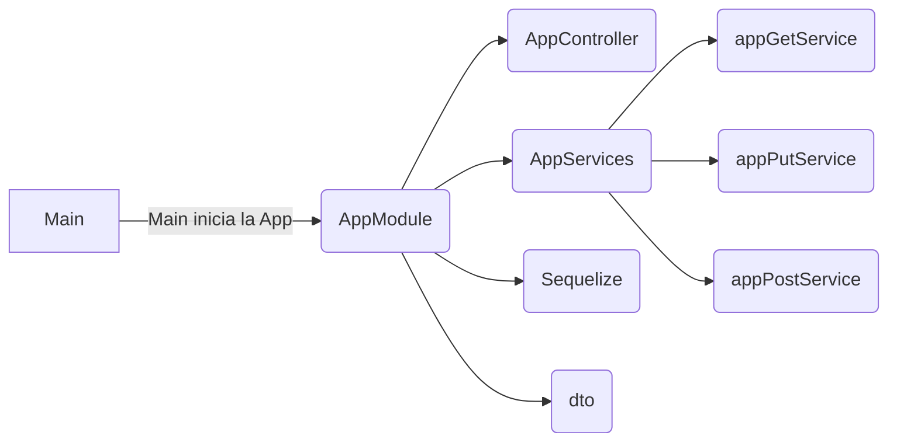

# API para freeRadius de Netcom Plus
<p align="center">

Creado usado Nest.JS y sobre Fastify

<a  href="http://nestjs.com/"  target="blank"></a>


<a  href="https://www.fastify.io/"  target="blank"></a>


</p>

  

[circleci-image]: https://img.shields.io/circleci/build/github/nestjs/nest/master?token=abc123def456

[circleci-url]: https://circleci.com/gh/nestjs/nest

  


  

## Descripción
### Descripción General

La API funciona con **Fastify** para lograr una aplicación más ligera que la que se tendría con Express y mucho más rápida al momento de procesar las peticiones.
Como el Framework de trabajo es **Nest.Js** , todo el código usa **TypeScript**, con una arquitectura de programación orientada a objetos (OOP) dónde el modelo básico es:

**Un controlador**: Encargado de manera las peticiones que entran a la API.

**Un servicio**: Que contiene las distintas lógicas que soportan las funciones de la API.

**Un modulo**:  Que se encarga de comunicar los distintos componentes de la API. 

<hr/>

###  Carpetas y Arquitectura general 




Aquí se puede ver la arquitectura general de la app.  Normalmente el modulo App sirve como ruta general de entrada y luego se divide en submódulos que alimentan a la app, pero dado que la aplicación tiene pocas funciones de momento, se deicidio dejarlo en un único modulo. 

>  Si la aplicación llega a crecer mucho se recomienda separarlo en módulos más pequeños.

La clase AppController es quién posee las rutas (endpoints) de la app y llama a los métodos contenidos en cada uno de los servicios. Normalmente habría un solo archivo de servicios pero para mayor facilidad se separo según el tipo de petición HTTP.

La carpeta **dto** contiene las clases DTO  (Data Transfer Object), que sirven de interfaz al momento de verificar que llega a través del Body y los tipos de datos, de las distintas requests, si no cumplen con el DTO la reques se rechaza.

 > Si bien se puede usar una interfaz, como tal JavaScript no posee interfaces, estas al momento de la transpilación son desechadas, perdiendo una capa de seguridad, por eso la documentación de Nest recomienda el uso de clases.

Finalmente la carpeta **Sequelize** contiene la conexión a la BD. La base de datos para la aplicación se encuentra desplegada en MariaDB pero la conexion hasta el momento se a trabajado con MySql.


<hr/>
  
 ### Fastify
Fastify es un framework web rápido y eficiente para Node.js. Está diseñado para ser altamente escalable y rendir al máximo, optimizando el tiempo de respuesta y el consumo de recursos. 

No hay que preocuparse mucho por aprender a manejar este Framework, ya que por lo general la sintaxis es manejada a través de Nest.Js, sin embargo, algunos paquetes para construir la API deben ser específicos de Fastify, por lo que requerirán un manejo particular para poder funcionar, como *CORS* o *Helmet*. Consulte las documentación pertinente según el caso. 

## Instalación
Obviamente requerimos Node.js, no se ha probado con Deno.js.
Deno.js debiera poder soportar la App, dando una capa extra de seguridad y una mayor velocidad a la app.
  

```bash

$  npm  install

```

  

## Corriendo la app

  Necesita Node.JS para correr la App.
  No se ha testeado en Deno.Js.

```bash

# Desarrollo

$  npm  run  start

  

# Modo watch 
#	Este modo está constantemente escuchando los cambios 
#	que se realizan en los archivos y reinicia la aplicación.

$  npm  run  start:dev

  

# Modo de producción.

$  npm  run  start:prod

```

  

## Test

  Hasta el momento no se han escrito test para la aplicación. Nest viene con algunos test por default.

```bash

# unit tests

$  npm  run  test

  

# e2e tests

$  npm  run  test:e2e

  

# test coverage

$  npm  run  test:cov

```

  

## Rutas
### Rutas Post
##### POST domain/

Esta ruta crea un nuevo usuario de los servicios y llena las tres tablas requeridas, "userinfo", "radcheck" y "radusergroup".
Valores mínimos requerido en el Body:
```
JSON {

username  :	string,
password" :	string,
firstname : string,
lastname  : string,
email	  : string (debe ser un formato válido),
mobilephone : string,
attribute : string,
op		  : string (de max-length 2),
value	  : araujo,
groupname :	string (plan asociado al cliente),
priority  : number,
createby":  string (del usuario que crea el objeto)

}

```


Sin embargo puede crear una respuesta aún más completa, si no llena los campos completos la API lo hace por usted colocando valores por defecto y evitando dejar espacios vacios en la BD.

```
JSON {
// Campos obligatorio de UserInfo
creationby	:  string,
username	:  string,
password	:  string,
firstname	:  string,
lastname	:  string,
email		:  string,
mobilephone :  string,

// No obligatorios de "userinfo"

department :  string;
company	   :  string;
workphone  :  string;
homephone  :  string;
address    :  string;
city       :  string;
state      :  string;
country    :  string;
zip 	   :  string;
notes	   :  string;
changeuserinfo 		:  string,
portalloginpassword	:  string,
enableportallogin	:  number,

//* RADCHECK *//
attribute	:  string,
op			:  string,
value		:  string,

//* RADUSERGROUP *//
groupname	:  string,
priority	:  number

}
```
##### POST domain/search
Permite buscar objetos de la tabla "userinfo" por medio de de strings que se comparan con los campos: username, fisrtname, lastname y email
```
JSON {
query: ["string", "string", "string"]
}
```

##### POST domain/radcheck
Permite buscar objetos de la tabla "radcheck" por medio de de strings que se comparan con el campo username.
```
JSON {
query: ["string", "string", "string"]
}
```

##### POST domain/radusergroup
Permite buscar objetos de la tabla "radusergroup" por medio de de strings que se comparan con el campo username.
```
JSON {
query: ["string", "string", "string"]
}
```

### Rutas Put
##### PUT domain/

> En domain iría el nombre de dominio o IP donde se aloje la API.
<br/>
> Por ejemplo: https://mi-api-freeradius.com/
> <br/>
> ó
> <br/>
	>ejemplo: https://64.192.2.0/
Compare el ejemplo dado con el ejemplo de más abajo.

Esta ruta permite editar los valores de una fila en la tabla "userinfo", por lo que solo se requiere de manera obligatoria el "id" que debe ser un número entero, "updateby" que debe ser el nombre del usuario que realiza la actualización y finalmente un cambio en alguno de los valores. De faltar alguno se rechaza la operación.

Retorna 0 si la operación fue exitosa o 1 su fue rechazada.

```

JSON {

updateby	:  string, # campo requerido
id			:  number, 	   # campo requerido

# el resto de los campo son opcionales,
# envie los que necesite modificar.

username	:  string,
password	:  string,
firstname	:  string,
lastname	:  string,
email		:  string,
mobilephone :  string,
department  :  string,
company		:  string,
workphone	:  string,
homephone	:  string,
address		:  string,
city		:  string,
state		:  string,
country		:  string,
zip			:  string,
notes		:  string,
changeuserinfo		: string,
portalloginpassword	:string,
enableportallogin	:  number

}

```
<br/>

##### PUT domain/radcheck

Permite editar los valores de un fila de la tabla "radcheck", requiere de manera obligatoria un "id" de tipo número entero para encontrar la fila a editar y y nuevo valor para realizar el cambio, de lo contrario se rechaza la operación.


> En domain iría el nombre de dominio o IP donde se aloje la API.
> Por ejemplo: https://mi-api-freeradius.com/radcheck
> ó
	>ejemplo: https://64.192.2.0/radcheck
	Compare el ejemplo dado con el ejemplo de arriba.
	


```
JSON {

id			:  number, # obligatorio
username	:  string,
attribute	:  string,
op			:  string,
value		:  string;

}
```
  <br/>
  
#####  PUT domain/radusergroup

Permite editar los valores de la tabla "usergroup", esta tabla particularmente no contiene "id" que permitan identificar los valores contenidos, en Sequelize se usó el campo "username" como Primary Key, por tanto, usamos ese campo para realizar las búsquedas y la ediciones de la tabla.

```
JSON {

username	:  string, # obligatorio
groupname	:  string,
priority	:  number,

}
```

### Rutas Get

##### GET domain/page/:offset

Las esta ruta trabaja con paginado de los elementos de la BD en la tabla "userinfo". Se debe enviar un número entero por *Param* en el *offset* dónde la primera página debe ser 0, la segunda 1, la tercera 2 etc.

Regresa un array de objetos "userinfo".
<br/>
##### GET domain/:id

Regresa un único objeto "userinfo", se debe enviar un número entero por *Param* con el id del objeto a buscar. Se pretende que esta ruta sirva de ayuda para ver el detalle de un "userinfo" y poder editar su información.
<br/>
##### GET radcheck/page/:offset

Las esta ruta trabaja con paginado de los elementos de la BD en la tabla "radcheck". Se debe enviar un número entero por *Param* en el *offset* dónde la primera página debe ser 0, la segunda 1, la tercera 2 etc.

Regresa un array de objetos "radusergroup". 
<br/>
##### GET  radcheck/:username

Regresa un único objeto "userinfo", se debe enviar un nombre en forma de string por *Param* con el id del objeto a buscar. Se pretende que esta ruta sirva de ayuda para ver el detalle de un "radusergroup" y poder editar su información.
<br/>
##### GET radcheck/:id

Las esta ruta trabaja con paginado de los elementos de la BD en la tabla "radcheck". Se debe enviar un número entero por *Param* en el *offset* dónde la primera página debe ser 0, la segunda 1, la tercera 2 etc.

Regresa un array de objetos "radcheck". 
<br/>
##### GET radusergroup/:username

Regresa un único objeto "userinfo", se debe enviar un nombre en forma de string por *Param* con el id del objeto a buscar. Se pretende que esta ruta sirva de ayuda para ver el detalle de un "radusergroup" y poder editar su información.
<br/>


## Creado por

- Autor - [FranSabt](https://github.com/FranSabt)

  

## Licencia

  

"Esta aplicación,  es *propiedad exclusiva* de **NetcomPlus**. Todos los derechos de propiedad intelectual relacionados con la aplicación, incluyendo, pero no limitándose a, derechos de autor, marcas comerciales y patentes, están debidamente registrados y reservados.

 Se ha invertido tiempo, recursos y esfuerzo considerable en su creación, y su contenido, diseño, funcionalidad y características únicas son propiedad exclusiva de NetcomPlus.

Cualquier reproducción, distribución, modificación, adaptación o uso no autorizado de esta aplicación sin el consentimiento expreso por escrito de NetcomPlus está estrictamente prohibido. Además, queda prohibida la extracción, recopilación o uso de cualquier dato, información o contenido de esta aplicación sin la autorización correspondiente.

NetcomPlus se reserva el derecho de tomar las medidas legales adecuadas para proteger sus derechos de propiedad intelectual en caso de infracción. Se realizarán esfuerzos razonables para mantener la precisión y disponibilidad de la aplicación, pero NetcomPlus no se hace responsable de cualquier interrupción o daño que pueda resultar del uso de esta aplicación.

Al utilizar esta aplicación, aceptas cumplir con estos términos y condiciones, así como con cualquier política o guía adicional establecida por NetcomPlus. En caso de dudas o consultas sobre los derechos de propiedad intelectual de esta aplicación, puedes comunicarte con NetcomPlus.

Al descargar, acceder o utilizar esta aplicación, reconoces y aceptas que todos los derechos están reservados y que cualquier infracción o uso no autorizado puede dar lugar a acciones legales.